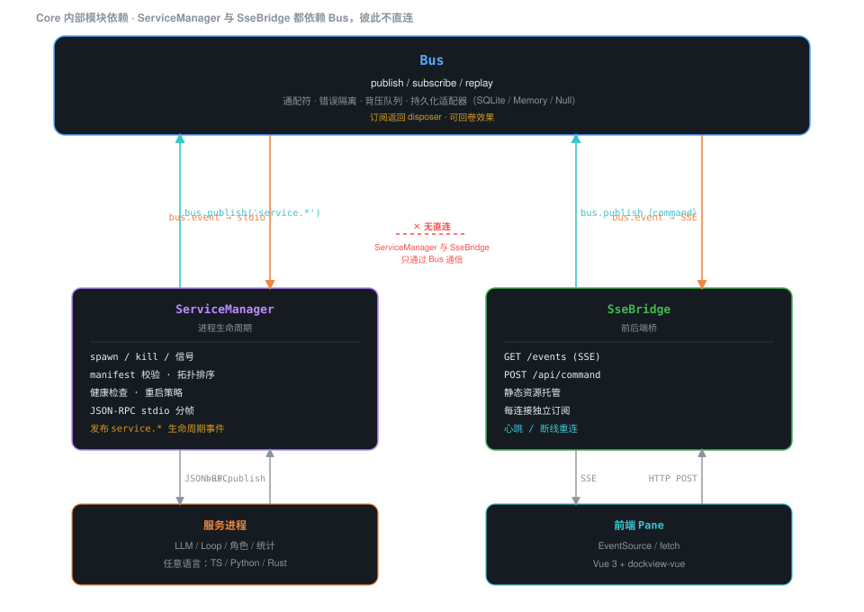

# 拆出独立的 Core RFC + 模块依赖图

## 一、`ost-core-rfc.md` 完整内容

```markdown
# Osteosome Core 微内核 RFC

> 状态：Draft ｜ 作者：dmql ｜ 日期：2026-09-23 ｜ 上游：`ost-开发文档.md`（v3）
> 范围：Core 微内核的完整契约 —— Bus / ServiceManager / SseBridge 三个模块的接口、事件契约、服务 SDK、目录结构
> 本 RFC 是 Core 开发的开工文档。Core 写一次就稳定，之后所有演化都发生在服务里。

---

## 0. 摘要

Osteosome 的终局形态是 **微内核 + 多语言服务 + 可观察总线**。

Core 极薄，只干三件事：

1. **进程管理** —— 读 manifest、拓扑排序、spawn / kill、健康检查、崩溃重启
2. **消息总线** —— publish / subscribe / replay，服务间不直连，全部经过它
3. **SSE 桥** —— `/events` 推事件给前端，`/api/command` 收前端命令

Core 不跑业务逻辑，不 import 任何业务模块。服务独立进程、语言自由、可单独重启而 Core 不重启。

**本 RFC 覆盖**：Core 三个模块的完整接口 + 事件契约规范 + 服务 SDK 契约 + 目录结构 + 实现路线图。

---

## 1. Core 总览

### 1.1 三个模块

| 模块 | 职责 | 关键接口 |
|---|---|---|
| **Bus** | 事件分发、持久化、回放 | `publish` / `subscribe` / `replay` |
| **ServiceManager** | 进程生命周期、manifest、健康检查 | `start` / `stop` / `restart` / `status` |
| **SseBridge** | 前后端桥、SSE 端点、命令投递 | `/events` / `/api/command` / 静态资源 |

### 1.2 依赖方向

三者是**单向依赖**：ServiceManager 和 SseBridge 都依赖 Bus，但**彼此不直接通信**。

```
ServiceManager ─┐
                ├──► Bus（+ 可选持久化）
SseBridge ──────┘
```

ServiceManager 需要 Bus 来：
- 发布 `service.*` 生命周期事件
- 转发服务进程发的 `bus.publish` 请求到 Bus
- 代表服务订阅 Bus，把事件推给服务进程

SseBridge 需要 Bus 来：
- 为每个 SSE 连接创建过滤后的 Bus 订阅
- 把 `/api/command` 的 POST 请求转成 `bus.publish`

**ServiceManager 和 SseBridge 之间没有直接调用** —— 这是设计的核心约束。

### 1.3 模块依赖图



（图见本节末。文字版描述：）

```
                      ┌──────────────────────────────────────┐
                      │              Bus                      │
                      │  publish / subscribe / replay         │
                      │  + 可选持久化（SQLite / 内存 / 无）    │
                      └────────┬──────────────────┬───────────┘
                               │                  │
              ┌────────────────┘                  └────────────────┐
              │                                                    │
              ▼                                                    ▼
     ┌──────────────────┐                             ┌──────────────────┐
     │ ServiceManager   │                             │   SseBridge      │
     │ - spawn / kill   │                             │ - /events (SSE)  │
     │ - manifest 校验   │                             │ - /api/command   │
     │ - 健康检查        │                             │ - 静态资源        │
     │ - JSON-RPC 分帧   │                             │ - 每连接独立订阅   │
     └────────┬─────────┘                             └─────────┬────────┘
              │ stdio JSON-RPC                                 │ HTTP / SSE
              ▼                                                 ▼
     ┌──────────────────┐                             ┌──────────────────┐
     │  服务进程          │                             │    前端 Pane      │
     │  LLM / Loop / ... │                             │  Vue + dockview  │
     └──────────────────┘                             └──────────────────┘
```

**箭头语义**：

| 编号 | 方向 | 含义 |
|---|---|---|
| ① | ServiceManager → Bus | `bus.publish('service.*')` —— 生命周期事件发布 |
| ② | Bus → ServiceManager | `bus.event` —— Core 把服务订阅的事件推给它，再由 ServiceManager 转发给服务进程 |
| ③ | SseBridge → Bus | `bus.publish` —— 前端 `/api/command` 命令投递到总线 |
| ④ | Bus → SseBridge | `bus.event` —— 总线上匹配的事件推给 SSE 连接 |
| ⑤ | ServiceManager → 服务进程 | stdio JSON-RPC：`initialize` / `bus.event` / `health.ping` |
| ⑥ | 服务进程 → ServiceManager | stdio JSON-RPC：`bus.publish` / `bus.subscribe` / `health.pong` |
| ⑦ | SseBridge → 前端 | SSE 事件流 |
| ⑧ | 前端 → SseBridge | HTTP POST 命令 |

**没有的箭头**：ServiceManager ↔ SseBridge 直连。**这是不变式：管道之间不直接说话，都经过 Bus。**

---

## 2. Bus —— 消息总线

### 2.1 接口

```ts
interface Bus {
  // ── 发布 ─────────────────────────────────────────
  publish<T extends EventKey>(
    topic: T,
    payload: EventPayload<T>,
    options?: { persist?: boolean }
  ): void

  // ── 订阅 ─────────────────────────────────────────
  subscribe<T extends EventKey>(
    topic: T | Pattern,
    handler: (payload: EventPayload<T>) => void | Promise<void>,
    options?: {
      once?: boolean
      priority?: number
      filter?: (payload) => boolean
    }
  ): () => void

  // ── 回放 ─────────────────────────────────────────
  replay(from: number, to: number, topics?: EventKey[]): AsyncIterable<Event>

  // ── 元信息 ───────────────────────────────────────
  stats(): { published: number; delivered: number; dropped: number }
  ready(): Promise<void>
}
```

### 2.2 语义

| 特性 | 说明 |
|---|---|
| **同步返回，异步投递** | `publish` 立即返回，handler 在微任务或下一个 tick 执行 |
| **错误隔离** | handler 抛错 → 捕获 → 打日志 → 继续投递下一个订阅者 |
| **通配符** | `llm.*` 匹配 `llm.request` / `llm.token` / `llm.done`；`*` 匹配所有 |
| **背压** | 内存队列上限 N（默认 10000），超限丢弃最旧并计 `stats.dropped` |
| **持久化白名单** | `persist: true` 或 topic 前缀白名单（`llm.*` / `loop.*` / `service.*`）才落库 |
| **订阅 disposer** | 返回函数，调用即取消订阅。这是"可回卷效果"的基础 |
| **优先级** | `priority` 数值越大越先执行，用于拦截型订阅 |

### 2.3 持久化适配器

```ts
interface PersistenceAdapter {
  append(event: Event): Promise<void>
  range(from: number, to: number, topics?: string[]): AsyncIterable<Event>
  close(): Promise<void>
}
```

内置实现：`SqliteAdapter`（默认）、`MemoryAdapter`（测试）、`NullAdapter`（不落库）。

### 2.4 不变式

- `publish` 的 payload **必须 JSON 可序列化**（无函数 / Symbol / 循环引用）
- 订阅 disposer **必须**被调用方持有，进程退出或组件卸载时回卷
- **慢订阅者不阻塞总线** —— 队列满时丢弃最旧并打日志

---

## 3. ServiceManager —— 进程生命周期

### 3.1 接口

```ts
interface ServiceManager {
  // ── 生命周期 ─────────────────────────────────────
  start(): Promise<void>
  stop(timeoutMs?: number): Promise<void>
  restart(serviceId: string): Promise<void>

  // ── 查询 ─────────────────────────────────────────
  status(serviceId: string): ServiceStatus
  list(): ServiceInfo[]
}

type ServiceStatus = 'starting' | 'ready' | 'restarting' | 'failed' | 'stopped'

interface ServiceInfo {
  id: string
  version: string
  status: ServiceStatus
  pid?: number
  startedAt?: number
  restartCount: number
}
```

### 3.2 Manifest 规范

```json
{
  "id": "llm",
  "version": "1.0.0",
  "protocolVersion": "1.0.0",
  "entry": "python -m llm_service",
  "cwd": "./services/llm",
  "inject": ["storage"],
  "publishes": ["llm.request.started", "llm.token.streamed", "llm.request.finished"],
  "subscribes": ["llm.request"],
  "panes": [
    { "id": "pane.llm.providers", "component": "ProvidersPane" },
    { "id": "pane.llm.config", "component": "LlmConfigPane" }
  ],
  "healthCheck": { "interval": 5000, "timeout": 2000 },
  "restartPolicy": { "maxRestarts": 3, "backoff": "exponential" }
}
```

必填字段：`id` / `version` / `protocolVersion` / `entry` / `publishes` / `subscribes`。
`inject` 用于拓扑排序，`panes` 用于前端注册，`healthCheck` 和 `restartPolicy` 有默认值。

### 3.3 启动顺序（拓扑排序）

```
1. 扫 services/*/service.json
2. 构建依赖图（inject → 有向边）
3. 拓扑排序
   - 若有环 → 拒绝启动（fail fast）
   - 若无环 → 得到启动序列
4. 按序启动每个服务
   - spawn 进程
   - 等 initialize 握手（超时 N 秒判定失败）
   - 注册到 Bus
   - 开始健康检查
5. 全部就绪后 → 广播 service.ready
```

停止时逆序。

### 3.4 stdio JSON-RPC 分帧

采用 **LSP 同款**的 `Content-Length` 头分帧，避免粘包：

```
Content-Length: 123\r\n
\r\n
{"jsonrpc":"2.0","id":1,"method":"initialize","params":{...}}
```

### 3.5 方法集

| 方向 | 方法 | 说明 |
|---|---|---|
| 服务 → Core | `initialize` | 握手，带 manifest 与协议版本；**响应含 `dataDir`**（服务数据根，见 §6.1 目录约定） |
| 服务 → Core | `bus.publish` | 发布事件到总线 |
| 服务 → Core | `bus.subscribe` | 订阅 topic |
| 服务 → Core | `bus.unsubscribe` | 取消订阅 |
| 服务 → Core | `health.pong` | 心跳应答 |
| 服务 → Core | `credentials.get` | 取凭证原值（仅服务进程；值不进总线 / SSE，见 §4.7） |
| 服务 → Core | `credentials.set` | 写入凭证（值只经 stdio，不入事件报文） |
| 服务 → Core | `credentials.delete` | 删除凭证 |
| 服务 → Core | `credentials.list` | 取凭证掩码列表（前端经 `/api/credentials` 同口径） |
| 服务 → Core | `shutdown` | 主动要求退出 |
| Core → 服务 | `bus.event` | 推送订阅的事件 |
| Core → 服务 | `health.ping` | 心跳探测 |
| Core → 服务 | `shutdown` | 要求优雅退出 |

### 3.6 生命周期事件（Core 自动发布到 Bus）

| Topic | 触发时机 | Payload |
|---|---|---|
| `service.starting` | spawn 进程后 | `{ serviceId, version }` |
| `service.ready` | initialize 握手成功 | `{ serviceId, version, panes }` |
| `service.restarting` | 崩溃后准备重启 | `{ serviceId, reason }` |
| `service.failed` | 重启超限或协议错误 | `{ serviceId, exitCode, reason }` |
| `service.stopped` | 正常停止 | `{ serviceId }` |

### 3.7 健康检查与重启策略

- 按 `healthCheck.interval` 发 `health.ping`，超时 `healthCheck.timeout` 判定失败
- 连续失败 N 次 → 判定进程无响应 → kill 并重启
- 重启次数超 `restartPolicy.maxRestarts` → 标记 `failed`，不再自动重启
- backoff：`exponential`（1s → 2s → 4s）或 `fixed`

### 3.8 优雅停止

```
SIGTERM → 等待 timeoutMs（默认 5000）→ SIGKILL
```

服务应捕获 SIGTERM，清理资源，发 `shutdown` 通知，然后自行退出。

---

## 4. SseBridge —— 前后端桥

### 4.1 端点

| 端点 | 方法 | 用途 |
|---|---|---|
| `/events` | GET | SSE 事件流，前端订阅总线事件 |
| `/api/command` | POST | 前端投递命令到总线 |
| `/api/preferences` | GET / PUT | 布局、主题、i18n 等偏好持久化 |
| `/api/credentials` | GET / PUT / DELETE | 凭证管理（GET 只回掩码；**原值永不经过 SSE**，见 §4.7） |
| `/*` | GET | 静态资源（Vue 构建产物） |

### 4.2 `/events` 语义

```
GET /events?topics=llm.*,loop.state,tools.*

→ 200 OK
→ Content-Type: text/event-stream

event: llm.token.streamed
data: {"requestId":"req-001","token":"你","index":0}

event: llm.request.finished
data: {"requestId":"req-001","usage":{"input":10,"output":42}}

: heartbeat
（每 30s 一条注释行，防代理超时）
```

**每个 SSE 连接 = 一个过滤后的 Bus 订阅**。连接关闭 → 自动 dispose 订阅。

- **不传 `topics`** → 订阅全部（调试用）
- **支持通配符** → `llm.*` / `*`
- **心跳** → 每 30s 发 `: heartbeat`
- **断线重连** → 浏览器 `EventSource` 自动重连，Core 可记录 `Last-Event-ID`（需持久化）

### 4.3 `/api/command` 语义

```
POST /api/command
Content-Type: application/json

{ "topic": "llm.request", "payload": { ... } }

→ 202 Accepted
```

**不等待处理结果**。结果通过 SSE 回来。这样命令投递是「发完就不管」的短请求，无需长连接。

### 4.4 接口

```ts
interface SseBridge {
  listen(): Promise<void>
  close(): Promise<void>
  connections(): number
  broadcast(event: string, data: unknown): void  // 系统级广播，绕过 Bus
}
```

### 4.5 静态资源

- Vue 构建产物由 Core 托管（`GET /*`）
- 生产环境同源，无 CORS
- 开发环境 Vite dev server 代理到 Core

### 4.6 跨窗支持

- 每个 Pane 独立开一个 SSE 连接（或共享一个，视架构）
- 弹窗（`#/pane/:id`）连上即收流，无需额外鉴权
- 同源共享 `localStorage` / cookie

### 4.7 凭证 seam（P4 落点）

- **归属**：凭证是 Core 职责（`core/src/credentials/`），非服务；落盘 `dataDir/credentials.json`（原子写，损坏降级）。
- **红线**：原值**永不进总线 / SSE / 事件 payload**。服务进程取原值走 JSON-RPC `credentials.get`（stdio，见 §3.5）；前端只见掩码（`GET /api/credentials`）。
- 事件（只增不改）：`credential.saved` / `credential.deleted` —— payload 仅 `{ id, name, provider }`，无值。
- 详细方案：`docs/开发进度/P4-详细计划.md` WS-1。

---

## 5. 事件契约规范

### 5.1 命名：`domain.entity.action`

```
格式：<domain>.<entity>.<action>

✅ 好例子：
  llm.request.started
  llm.token.streamed
  llm.request.finished
  loop.state.changed
  character.changed
  tools.executed
  service.ready
  session.created

❌ 坏例子：
  llmRequestStarted          // 没有分隔符，无法通配符匹配
  llm_req_start              // 下划线风格不一致
  LLM.REQUEST.STARTED        // 大写，阅读负担
  llm.request.start          // 时态混乱（started vs start）
  update                     // 太泛，没有 domain 前缀
```

| 段 | 约定 | 已有域 |
|---|---|---|
| **domain** | 服务归属 | `llm` `loop` `character` `tools` `storage` `session` `service` `ui` |
| **entity** | 被操作的对象 | `request` `token` `message` `state` `call` `event` |
| **action** | 过去式动词（事件是既成事实） | `started` `streamed` `finished` `changed` `failed` `executed` `ready` |

**为什么用过去式**：事件是「已经发生的事」，不是命令。命令用另一个通道（`/api/command`），事件用过去式，语义清晰。

### 5.2 版本：只增不改

| 变更类型 | 做法 | 示例 |
|---|---|---|
| **加字段** ✅ | 直接加，不改 topic | `llm.token { token }` → `{ token, index }` |
| **加可选字段** ✅ | 直接加，标注 optional | `llm.done { usage? }` |
| **删字段** ❌ | 标记 deprecated，两个版本周期后删 | — |
| **改字段类型** ❌ | 升版本：`llm.token.v2` | 旧前端订阅 `llm.token`，新前端订阅 `llm.token.v2` |
| **改语义** ❌ | 升版本，或换新 topic | — |

### 5.3 Payload 公共字段

```ts
interface EventBase {
  ts: number          // 时间戳（毫秒）
  source: string      // 发布者 serviceId，如 'llm' / 'loop'
  requestId?: string  // 一对一请求-响应配对
  traceId?: string    // 关联链（一个用户操作触发多个服务协作）
  sessionId?: string  // 会话上下文
}
```

### 5.4 Payload 约束

| 约束 | 值 | 理由 |
|---|---|---|
| payload 大小 | ≤ 256KB（建议） | 超过则存 blob，事件里带引用 ID |
| 高频事件速率 | ≤ 1000/s（建议） | 超过则批量合并（如 `llm.token.batch`） |
| 必填字段 | `ts` `source` | 审计、排序、溯源 |
| 禁止字段 | 函数 / Symbol / 循环引用 / BigInt | JSON 序列化会失败 |
| 敏感数据 | 不落库，或脱敏后落库 | API key / 用户隐私 |

### 5.5 类型共享

事件类型定义在 `shared/events.ts`，Core、服务、前端共用同一份。

```ts
// shared/events.ts
declare module '@osteosome/bus' {
  interface EventMap {
    'llm.request.started': { requestId: string; provider: string; model: string }
    'llm.token.streamed': { requestId: string; token: string; index: number }
    'llm.request.finished': {
      requestId: string
      usage: { input: number; output: number }
      finishReason: 'stop' | 'length' | 'error'
    }
    'loop.state.changed': { sessionId: string; state: 'idle' | 'running' | 'paused' }
    'service.ready': { serviceId: string; version: string }
    'service.failed': { serviceId: string; exitCode: number; reason: string }
  }
}
```

**三处消费**：

```ts
// ① 服务里发布（编译期检查）
bus.publish('llm.token.streamed', { requestId, token, index })

// ② 前端订阅（payload 自动推导）
useEventBus('llm.token.streamed', (e) => { currentMsg += e.token })

// ③ Core 内部过滤（handler 参数自动推导）
bus.subscribe('service.failed', (e) => services.restart(e.serviceId))
```

**这是 TS 相对 Python / Rust 的核心收益**：事件类型一份定义，三处消费，编译期检查。

### 5.6 落库白名单

| 事件类型 | 是否落库 | 判断依据 |
|---|---|---|
| `llm.request.started` | ✅ 落 | 进入模型上下文的内容 |
| `llm.token.streamed` | ✅ 落（或聚合后落） | 模型输出 |
| `llm.request.finished` | ✅ 落 | 模型响应完成 |
| `loop.state.changed` | ✅ 落 | 会话状态变更 |
| `service.ready` | ✅ 落 | 审计需要 |
| `ui.hover` | ❌ 不落 | 纯 UI 瞬时状态 |
| `ui.scroll` | ❌ 不落 | 同上 |

**默认不落，避免高频 UI 事件写爆 DB。**

### 5.7 首批事件清单

| Topic | 发布者 | 订阅者 | 落库 | 用途 |
|---|---|---|---|---|
| `llm.request.started` | LLM | Loop / 统计 | ✅ | 调用开始 |
| `llm.token.streamed` | LLM | Loop / 聊天 Pane | ✅ | 流式 token |
| `llm.request.finished` | LLM | Loop / 统计 | ✅ | 调用完成 + usage |
| `loop.state.changed` | Loop | 聊天 Pane / 角色 Pane | ✅ | idle / running / paused |
| `character.changed` | 角色 | 角色 Pane | ✅ | 档案更新 |
| `tools.executed` | Loop | 统计 / 日志 | ✅ | 工具调用 |
| `service.starting` | Core | 全部前端 | ✅ | 服务启动中 |
| `service.ready` | Core | 全部前端 | ✅ | 服务就绪 |
| `service.failed` | Core | 全部前端 | ✅ | 服务崩溃 |
| `service.restarting` | Core | 全部前端 | ✅ | 重启中 |
| `ui.activeSession.changed` | 前端 | 前端（BroadcastChannel） | ❌ | 跨窗会话同步 |
| `ui.layout.changed` | 前端 | 前端（BroadcastChannel） | ❌ | 布局变更 |

---

## 6. 服务 SDK 契约

### 6.1 握手协议

```
1. Core → 服务：spawn 进程
2. 服务 → Core：request 'initialize'
   {
     "jsonrpc": "2.0", "id": 1, "method": "initialize",
     "params": {
       "protocolVersion": "1.0.0",
       "serviceId": "llm",
       "coreVersion": "3.0.0",
       "manifest": { ... }
     }
   }
3. Core → 服务：response
   {
     "jsonrpc": "2.0", "id": 1,
     "result": {
       "sessionId": "core-session-abc",
       "heartbeatInterval": 5000,
       "dataDir": "/Users/dmql/.osteosome"    // ★ 数据根目录（--data 传入）
     }
   }
4. 服务 → Core：notification 'initialized'
5. 双向进入运行态：publish / subscribe / heartbeat
6. 服务退出前：notification 'shutdown'，Core 回 'exit'
```

> **数据目录约定**：`dataDir` 令服务进程知道往哪儿写数据——只写自己的 `serviceDataDir(dataDir, serviceId)` = `${dataDir}/services/<serviceId>/`（`shared/src/paths.ts`，P1a §3.1）；`dataDir/credentials.json` 是 Core 自己的，例外。

### 6.2 Manifest 校验（SDK 启动时执行）

1. **schema 校验** —— 字段类型正确，必填存在
2. **版本校验** —— `protocolVersion` 与 Core 兼容
3. **事件一致性** —— `publishes` / `subscribes` 的 topic 必须在 `shared/events.ts` 声明

不一致 → 拒绝启动（fail fast），Core 广播 `service.failed`。

### 6.3 TS SDK 骨架

```ts
// services/llm/src/index.ts
import { Service, bus, logger } from '@osteosome/service-sdk'

const service = new Service({ id: 'llm', version: '1.0.0' })

service.subscribe('llm.request', async (req) => {
  const { requestId, provider, model, messages } = req

  bus.publish('llm.request.started', {
    ts: Date.now(), source: 'llm', requestId, provider, model,
  })

  try {
    for await (const token of callProvider(provider, model, messages)) {
      bus.publish('llm.token.streamed', {
        ts: Date.now(), source: 'llm', requestId, token: token.text, index: token.index,
      })
    }
    bus.publish('llm.request.finished', {
      ts: Date.now(), source: 'llm', requestId, usage: {...}, finishReason: 'stop',
    })
  } catch (err) {
    bus.publish('llm.request.finished', {
      ts: Date.now(), source: 'llm', requestId, usage: null, finishReason: 'error',
    })
  }
})

service.start().catch((err) => {
  logger.error('LLM service failed to start', err)
  process.exit(1)
})
```

### 6.4 Python SDK 骨架

```python
# services/llm-python/src/main.py
import asyncio
from osteosome_service import Service, bus, logger

service = Service(id="llm-python", version="1.0.0")

@service.subscribe("llm.request")
async def handle_llm_request(req: dict):
    request_id = req["requestId"]
    bus.publish("llm.request.started", {
        "ts": ..., "source": "llm-python",
        "requestId": request_id,
        "provider": req["provider"],
        "model": req["model"],
    })
    try:
        async for token in call_provider(req["provider"], req["model"], req["messages"]):
            bus.publish("llm.token.streamed", {
                "ts": ..., "source": "llm-python",
                "requestId": request_id,
                "token": token.text, "index": token.index,
            })
        bus.publish("llm.request.finished", {
            "ts": ..., "source": "llm-python",
            "requestId": request_id,
            "usage": {"input": 10, "output": 42},
            "finishReason": "stop",
        })
    except Exception as err:
        logger.error(f"LLM call failed: {err}")

if __name__ == "__main__":
    asyncio.run(service.start())
```

### 6.5 SDK 覆盖的通用能力

| 能力 | SDK 内部实现 |
|---|---|
| stdio 分帧 | `Content-Length` 解析、粘包处理、UTF-8 边界 |
| 握手 | 自动发送 `initialize`，等 Core 响应，失败重试 |
| 心跳 | 收到 `health.ping` 自动回 `health.pong` |
| 事件分派 | 收到 `bus.event` → 按 topic 匹配 handler → 异步执行 |
| 订阅管理 | 进程退出前自动 `unsubscribe` |
| 优雅退出 | 捕获 SIGTERM → 停止接受新事件 → 等处理完成 → `shutdown` |
| 日志 | 写 stderr（不污染协议流），Core 收集并聚合 |
| 错误上报 | handler 抛错 → SDK 捕获 → 发 `service.handler-error` |

### 6.6 多语言路线

| 语言 | 阶段 | 理由 |
|---|---|---|
| **TS** | 阶段 1-2 | 和 Core 同语言，复用 `shared/events.ts`；内置服务全部用它 |
| **Python** | 阶段 3 | AI / 数据处理生态；LLM 服务可能第一个换 Python |
| **Rust** | 阶段 4 | 性能敏感服务；或复用已有 Rust 库 |
| **Go** | 阶段 4 | 并发密集服务；或团队已有 Go 代码 |

**不要一次做全部**：SDK 是最大的工作量。先做 TS（自己用），再做一个 Python（验证协议中立性）。

---

## 7. Core 目录结构

### 7.1 仓库总览

```
osteosome/
├── package.json                    # monorepo root（pnpm workspaces）
├── pnpm-workspace.yaml
├── tsconfig.base.json
│
├── core/                           # 微内核（TS / Node）
├── services/                       # 内置服务（独立进程）
├── shared/                         # Core / 服务 / 前端共享的类型与工具
├── sdk/                            # 服务 SDK（多语言）
├── client/                         # Panel / Widget 工作台（Vue 3 + dockview-vue + vue-movable-box）
├── desktop/                        # Electron 壳
└── docs/                           # RFC / 开发文档
```

### 7.2 core/ —— 微内核

```
core/
├── package.json                    # name: @osteosome/core
├── tsconfig.json
├── src/
│   ├── main.ts                     # 入口：组装 Bus + ServiceManager + SseBridge
│   ├── bus/
│   │   ├── bus.ts                  # Bus 实现（publish / subscribe / replay）
│   │   ├── pattern.ts              # 通配符匹配（llm.* / *）
│   │   ├── persistence.ts          # 持久化适配（SQLite / 内存 / 无）
│   │   └── types.ts                # EventKey / EventPayload / EventBase
│   ├── service-manager/
│   │   ├── manager.ts              # ServiceManager 实现
│   │   ├── process.ts              # spawn / kill / 信号处理
│   │   ├── manifest.ts             # manifest 加载与 schema 校验
│   │   ├── topology.ts             # 依赖拓扑排序
│   │   ├── health.ts               # 心跳检查与重启策略
│   │   └── jsonrpc/
│   │       ├── framing.ts          # Content-Length 分帧
│   │       ├── client.ts           # Core 侧 JSON-RPC 客户端
│   │       └── protocol.ts         # 方法集定义
│   ├── sse-bridge/
│   │   ├── server.ts               # HTTP 服务器（Hono 或原生）
│   │   ├── sse.ts                  # /events 端点
│   │   ├── command.ts              # /api/command 端点
│   │   └── static.ts               # 静态资源托管
│   ├── config/
│   │   ├── config.ts               # 配置加载
│   │   └── paths.ts                # dataDir / servicesDir / distDir
│   └── logger.ts                   # 统一日志
└── tests/
    ├── bus.test.ts
    ├── manager.test.ts
    └── sse.test.ts
```

**代码量预估**：核心三个模块约 **1500-2000 行**（含 JSON-RPC 分帧与协议）。这是 Core 的全部。

### 7.3 services/ —— 内置服务

```
services/
├── llm/                            # LLM 服务
│   ├── service.json                # manifest
│   ├── package.json
│   ├── src/
│   │   ├── index.ts                # service.start() + subscribe('llm.request')
│   │   ├── providers/              # 服务商适配器
│   │   ├── stream.ts               # 流式 token 解析
│   │   └── usage.ts                # usage 记账
│   └── tests/
├── loop/                           # Loop 服务
├── character/                      # 角色服务
├── storage/                        # storage 服务（DB 唯一持有者）
└── stats/                          # 统计服务（旁路消费者 · 零侵入）
```

**每个服务的结构一致**：`service.json` + `src/index.ts` + 业务模块。

### 7.4 shared/ —— 共享层

```
shared/
├── package.json                    # name: @osteosome/shared
└── src/
    ├── events.ts                   # 事件类型定义（declare module merging）
    ├── manifest.ts                 # Manifest 类型 + Zod schema
    ├── protocol.ts                 # JSON-RPC 协议版本、方法集
    └── types.ts                    # 通用类型（ServiceId / PaneId / ...）
```

**shared/ 是 Core / 服务 / 前端共享的唯一真相源。** 改 shared/ 的类型 → 三处编译期同时报错。

### 7.5 sdk/ —— 服务 SDK

```
sdk/
├── ts/                             # TypeScript SDK
│   ├── package.json                # name: @osteosome/service-sdk
│   └── src/
│       ├── service.ts              # Service 类
│       ├── transport.ts            # stdio 分帧 + JSON-RPC
│       ├── handshake.ts            # initialize 握手
│       ├── heartbeat.ts            # health.ping/pong
│       └── logger.ts               # stderr 日志
├── python/                         # Python SDK（阶段 3）
└── rust/                           # Rust SDK（阶段 4）
```

---

## 8. 实现路线图（修订 v2 · 2026-09-23）

> **修订说明**（由「阶段 A-D」重组为「里程碑 P1-P8」，状态追踪见 `阶段追踪.md`）：
>
> 1. **P1 拆成 P1a（Core）+ P1b（Pane 工作台）** —— 各有独立可验收绿灯，避免一次 PR 太大。
> 2. **显式插入 P3 最小 Loop** —— 角色 / 技能 / MCP 都挂在 session loop 上，必须早于 P5-P7。
> 3. **P2 写死单 provider，但必须走中立流契约** —— P4 只换 providers 层，不重写骨架。
> 4. **基座评估（2026-09-23）**：P1-P4 为基座，各阶段扩展 30~50%（P1a 补强 2 处 / P1b 加组件库 / P2 落接缝三角 / P3 加会话存储 / P4 加凭证 seam + 设置 Pane），P5-P8 保持；周期已上调，各阶段详案见 `docs/开发进度/`。

### P1a · Core 微内核 + hello-world 服务（1-2 周）

> 含 2 处小补强：framing 非法 `Content-Length` → 丢帧 + 打日志不关连接；sse 90s 无有效写 → 断僵尸连接（客户端 EventSource 自动重连兜底）。见 `docs/开发进度/P1a-详细计划.md` 附录 A。

- [x] `core/src/bus/` —— publish / subscribe / replay、通配符、背压、`stats()`、持久化适配器（Memory / Null，SQLite 延后）
- [x] `core/src/service-manager/` —— manifest 校验、拓扑排序、spawn / kill、健康检查、重启策略、优雅停止
- [x] `core/src/service-manager/jsonrpc/` —— Content-Length 分帧 + 握手 + 方法集
- [x] `core/src/sse-bridge/` —— `/events` + `/api/command` + `/api/preferences` + 静态资源
- [x] `sdk/ts/` —— Service / transport / handshake / heartbeat / logger
- [x] `shared/events.ts` —— 首批事件类型定义
- [x] **绿灯**：Core 单元测试（bus / manager / sse）全绿 + `build` 零错误 + hello-world TS 服务端到端（/health 可接、spawn、事件推流）

### P1b · Panel / Widget 工作台骨架 + 通用组件库（2-3 周）

> 当前前端实现细节以 [`前端工作台-现行实现.md`](./前端工作台-现行实现.md) 为准。

- [x] 前端骨架：`main.ts` + `App.vue` + `DockviewLayout.vue` + `PanelContainer.vue` + `PanelHost.vue`
- [x] 外层布局：dockview 管理 Panel 停靠、拆分、比例和 `SerializedDockview` 快照
- [x] 内层布局：vue-movable-box 管理 Widget 拖动、缩放、吸附和 `params.layout`
- [x] 通用组件库（WS-1b）：`components/ui` 18 个 + `components/layout` 3 个，全部消费 `tokens.css`
- [x] `widgets/registry.ts` —— `defineWidget` + `import.meta.glob` 自动发现
- [x] `core-sdk/` —— `sse.ts` 单例（全应用单 SSE 连接）+ `useEventBus` / `useCommand` / `useServiceStatus` / `usePreferences`
- [x] 布局模型：Panel 外层和 Widget 内层一起保存到 `/api/preferences`
- [x] **绿灯**：Panel 停靠 / Widget 拖拽缩放 / 刷新还原 / 拉出独立窗；`pnpm test` + `pnpm build` 零错误

### P2 · 最小 LLM 对话（DSH 接缝三角·单 provider 实现）（1 周）

> 注意：wire 走中立流契约（`llm.request` → `llm.token.streamed` / `llm.request.finished`）；接口先于实现——`LlmAdapter` 接口 / `StreamChunk` 块协议 / 凭证引用 resolver / retry 声明在本阶段落地，deepseek 是唯一真实现，P4 只加 provider 实现与执行器，不重写骨架。详案 `docs/开发进度/P2-详细计划.md`。

- [ ] `services/llm/` —— manifest + index.ts；`adapter/{types,registry,deepseek}.ts` + `stream.ts`（native SSE → StreamChunk）
- [ ] `credentials/resolver.ts`（`env:` v1，预留 `core:`）+ `retry/policy.ts`（声明不执行）+ 错误码化
- [ ] 事件契约：`llm.request.started` / `llm.token.streamed` / `llm.request.finished` / `llm.request.failed`
- [ ] 前端 ChatPane：`POST /api/command` → SSE 收流式 token
- [ ] **绿灯**：前端点击 → SSE 收到流式 token；缺 API key → `missing_credential` 错误占位；重启 LLM 服务不影响 Core

### P3 · 会话存储 + 最小 Loop · 会话编排（2-3 周）

- [ ] `services/session/` —— 会话 CRUD + 消息 append-only，dataDir JSON 持久化（SQLite 延后 P8）；4 事件 `session.created/updated/deleted` + `message.appended`；命令/结果 IPC（`session.list/get/...` + `message.append`）
- [ ] 会话列表 Pane（新建 / 切换 / 重命名 / 删除 / 当前高亮，跨窗 SSE 同步）
- [ ] `services/loop/` —— 读会话历史 → 组装多轮 messages → 跑 loop → 流式回填 → 落 `message.appended`
- [ ] `loop.state.changed` 事件（idle / running）+ 防重入 + `loop.run.failed`
- [ ] 前端 loop 状态展示 + ChatPane 会话化（历史加载 / 流式追加绑定当前会话）
- [ ] **绿灯**：新建会话发问 → 流式回填 → 落库；刷新 / 双窗历史完整；切会话互不干扰；kill loop 自动恢复

### P4 · 多模型服务商管理（凭证 seam + 设置 Pane）（1.5-2 周）

- [ ] 凭证 seam：`core/src/credentials/`（store + api）+ JSON-RPC `credentials.*`（§3.5）+ `/api/credentials` 掩码端点（§4.1）+ `credential.saved/deleted` 事件（**值永不进总线**，§4.7）；resolver 接 `core:` kind
- [ ] providers 契约对齐（§16）：三 provider 适配器（openai / anthropic / openrouter）+ `format` 删除 + 错误码化 + 模型目录 `listModels()` + disjoint 记账（usage 归一落 `Message.usage`）
- [ ] retry 执行器：`retry/engine.ts` 读 P2 声明（backoff + jitter + `retryableCodes`）
- [ ] 设置 Pane 套件：`settings-pane` / `llm-settings`（provider 增删改查 + 凭证绑定 + 模型下拉）/ `ui-settings`（主题 + i18n，P1b 延后项补齐）/ `advanced-settings`
- [ ] **绿灯**：四家 provider 均能流式对话；新增服务商不再手改单函数；凭证值全程不进总线 / SSE

### P5 · 角色（1 周）

- [ ] `services/character/` —— 档案管理（人设 / 模型 / 工具 / 技能 / 头像）
- [ ] 角色绑定 model / tools / skills
- [ ] `character.changed` 事件 + 角色 Pane
- [ ] **绿灯**：切换角色影响对话行为

### P6 · 技能（1-2 周）

- [ ] 技能包（SKILL.md），按需懒加载
- [ ] 技能注入 loop
- [ ] **绿灯**：技能包可独立卸载 / 替换，布局与运行不崩

### P7 · MCP + 工具管线（1-2 周）

- [ ] 工具执行管线（pre / execute / post + 审批 listener）
- [ ] MCP server 接入（检测本机 MCP、导入 JSON 配置）
- [ ] `tools.executed` 事件
- [ ] **绿灯**：loop 调用外部 MCP 工具，审批与执行解耦

### P8 · 记忆 · 事件持久化 + 回放（远期）

- [ ] 关键事件落 SQLite + `bus.replay(from, to)`
- [ ] 记忆服务（髓）：会话记忆检索 / 注入 / 重放派生
- [ ] `shadowedSeqs` 书签 + 压缩 seam（dsh compaction 形状）
- [ ] **绿灯**：服务重启后记忆与统计可恢复

### 里程碑 ↔ RFC 阶段对照

| 里程碑 | 对应 RFC 阶段 | 说明 |
|---|---|---|
| P1a | 阶段 A | Core 骨架 + hello-world |
| P1b | §8.6 client + §11 | 前端工作台骨架 |
| P2 | 阶段 B（收缩） | 只做 LLM 服务 + 单 provider + ChatPane |
| P3 | 阶段 C（loop） | 会话编排引擎，拆到角色之前 |
| P4 | §16 A组④ | LLM 适配器契约对齐 |
| P5 | 阶段 C（character） | 角色服务 |
| P6 | 阶段 C（skills） | 技能包（B组原封不动区） |
| P7 | A组③ + MCP | 工具管线 + MCP |
| P8 | 阶段 D | 持久化 + 回放 + 记忆 |

---

## 9. 术语表

| 术语 | 含义 |
|---|---|
| **Core** | 微内核：Bus + ServiceManager + SseBridge |
| **服务** | 独立进程，语言自由，通过 stdio JSON-RPC 与 Core 通信 |
| **Manifest** | 服务的声明文件 `service.json` |
| **Bus** | 消息总线，publish / subscribe / replay |
| **Topic** | 事件类型名，格式 `domain.entity.action` |
| **Panel** | dockview 管理的外层工作台单元，可停靠、拆分和独立打开 |
| **Widget** | Panel 内的最小业务组件，由 vue-movable-box 管理几何 |
| **Pane** | 旧 P1b 兼容术语；当前主链路使用 Panel / Widget |
| **SSE** | Server-Sent Events，服务端推事件给前端 |
| **旁路消费者** | 只订阅不发布的服务（统计 / 日志 / 审计） |
| **Model-visible means logged** | 进入模型上下文的内容必须有 durable 事件 |

---

## 10. 参考

- 上游文档：`ost-开发文档.md`（v3）
- DeepSeek Harness 文档：「Everything is a Plugin」
- Cordis Primer：https://github.com/cordiverse/cordis
- dockview 文档：https://dockview.dev
- LSP 规范（stdio 分帧参考）：https://microsoft.github.io/language-server-protocol/
```

---

## 二、Core 模块依赖图（独立 SVG）


**图中箭头颜色语义**：

| 颜色 | 含义 |
|---|---|
| 🟦 **青色**（向上） | **发布 / 投递** —— 向 Bus 发事件 |
| 🟧 **橙色**（向下） | **推送** —— Bus 向订阅者推事件 |
| ⬜ **灰色** | **协议层通信** —— stdio JSON-RPC / HTTP / SSE |

**读图要点**：

1. **Bus 是唯一的枢纽** —— 所有跨模块的事件流都经过它
2. **ServiceManager 和 SseBridge 对称** —— 都是 Bus 的「端口」，各自向内 publish、向外 push
3. **中央的红色 ✕** —— 明确标识「两者不直连」这条不变式
4. **底部两个终端** —— 服务进程（左）和前端 Panel / Widget（右）分别是两个端口的对端

---

## 三、RFC 与 SVG 的关系

```
ost-core-rfc.md
├── §1.3 引用 core-modules.svg（本 SVG）
├── §2-4 三个模块的接口（对应 SVG 中三个矩形）
├── §5 事件契约（对应 SVG 中 Bus 上的标注）
├── §6 服务 SDK（对应 SVG 底部两个终端）
└── §7 目录结构（对应三个模块的代码落点）
```

**RFC 里推荐的内嵌方式**（GitHub / 任何支持 HTML 的 Markdown 渲染器都能显示）：

```markdown
### 1.3 模块依赖图

<div align="center">
  
</div>

（若渲染器不支持 SVG 引用，直接内联 <svg> 标签）
```

---

